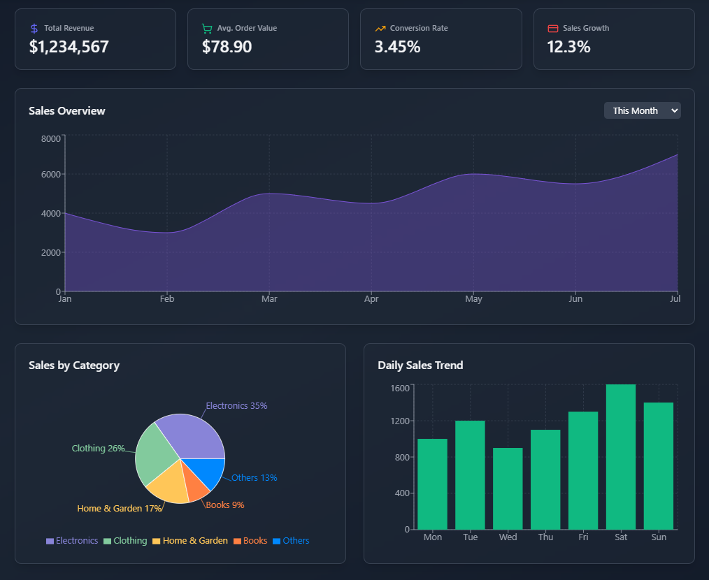
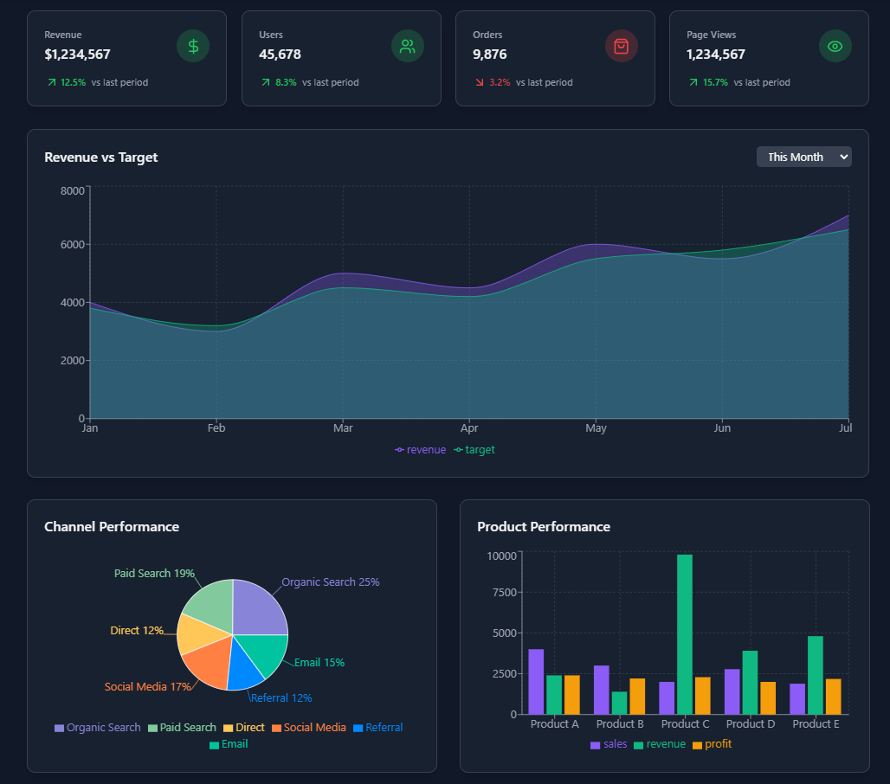

# Admin Dashboard 📊

A modern **Admin Dashboard** built using **React.js** and **Recharts**, providing insightful data visualizations and analytics for better decision-making.

🌍 Live Demo: [Admin Dashboard](https://admin-dashboard-rp48.vercel.app/)

## 🚀 Features

- 📈 **Data Visualization** – Interactive charts and graphs using **Recharts**.
- 🎨 **Responsive UI** – Optimized for desktop and mobile screens.
- 🔍 **User Analytics** – View user growth, retention, and activity trends.
- 🛒 **Sales Insights** – Track sales, revenue, and product performance.
- ⚙️ **Settings Panel** – Manage user accounts, security settings, and notifications.
- 🏷 **Customizable** – Easily adaptable for different industries and use cases.

## 🛠️ Tech Stack

- **Frontend:** React.js, Tailwind CSS
- **Charts:** Recharts
- **State Management:** Context API / Redux (if used)
- **Routing:** React Router
- **Deployment:** Vercel / Netlify

## 📸 Screenshots




## 🔧 Installation

1. Clone the repository:
   ```sh
   git clone https://github.com/your-username/admin-dashboard.git
   cd admin-dashboard
   ```
2. Install dependencies:
   ```sh
   npm install
   ```
3. Start the development server:
   ```sh
   npm run dev
   ```
4. Build for production:
   ```sh
   npm run build
   ```
